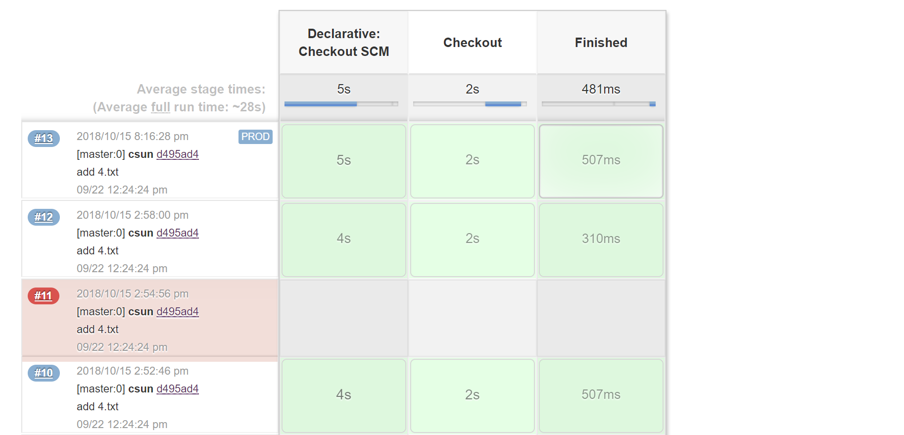

# Pipeline Stage View Plugin

This plugin is a fork of Jenkins Pipeline Stage View Plugin, a graphical swimlane view of pipeline stage execution (as well as a build history of the stages). 

See the [Plugin Wiki](https://wiki.jenkins-ci.org/display/JENKINS/Pipeline+Stage+View+Plugin) for release information and documentation. 

## Custom Enhancements: 

- Display last commit branch name
- Display last commit author, description
- Display change set total commits
- Display change set commits history with popup
- Display environment

