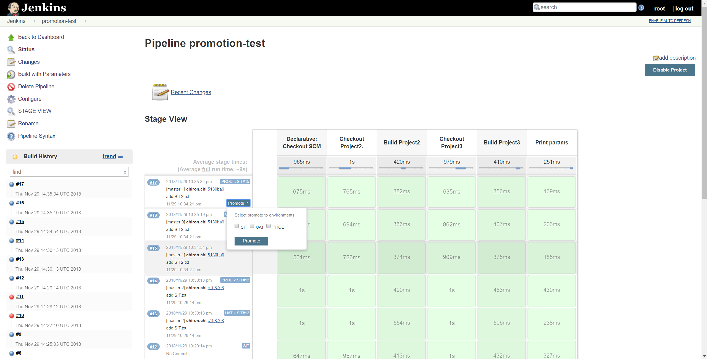
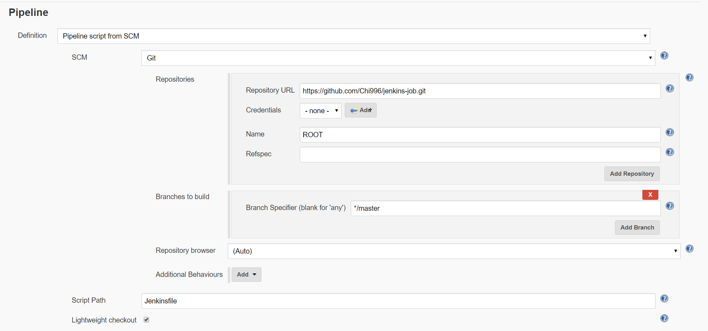

# Pipeline Stage View Plugin

This plugin is a fork of Jenkins Pipeline Stage View Plugin, a graphical swimlane view of pipeline stage execution (as well as a build history of the stages). 

See the [Plugin Wiki](https://wiki.jenkins-ci.org/display/JENKINS/Pipeline+Stage+View+Plugin) for release information and documentation. 

## Custom Enhancements: 

- Display last commit branch name
- Display last commit author, description
- Display change set total commits
- Display change set commits history with popup
- Display environment
- Add pipeline promote build support



## How to install

1. Download `pipeline-rest-api.jpi`, `pipeline-promote-api.jpi`, `pipeline-stage-view.jpi`
2. `cd $JENKINS_HOME`, copy and replace the 3 files

> Note: Skip pipeline-promote-api.jpi will disable the promote function from pipeline-state-view. 

## How to use promote plugin

1. Create a new pipeline job
2. Select "This project is parameterized", add String parameter ENVIRONMENT
3. Config pipeline with SCM

4. Edit Jenkinsfile. An example:
```
pipeline {
    agent any

    stages {
        stage('Checkout Project2.') {
            steps {
                script {
                    if (params.PROMOTE_FROM_ENVIRONMENT != null) {
                        checkout([$class: 'GitSCM',
                        		branches: [[name: params.PROJECT2_GIT_COMMIT]],
                        		userRemoteConfigs: [[url: 'https://github.com/Chi996/jenkins-test-project2.git', name:'project2']]])
                    }else{
                        checkout([$class: 'GitSCM',
                                 branches: [[name: params.ENVIRONMENT]],
                                 userRemoteConfigs: [[url: 'https://github.com/Chi996/jenkins-test-project2.git', name:'project2']]])
                    }
                }
            }
        }
        stage('Build Project2') {
             steps {
                 sh 'ls -al'
             }
        }
        stage('Checkout Project3') {
            steps {
                script {
                    if (params.PROMOTE_FROM_ENVIRONMENT != null) {
                        checkout([$class: 'GitSCM',
                                branches: [[name: params.PROJECT3_GIT_COMMIT]],
                                userRemoteConfigs: [[url: 'https://github.com/Chi996/jenkins-test-project3.git', name:'project3']]])
                    }else{
                        checkout([$class: 'GitSCM',
                                 branches: [[name: params.ENVIRONMENT]],
                                 userRemoteConfigs: [[url: 'https://github.com/Chi996/jenkins-test-project3.git', name:'project3']]])
                    }
                }
            }
        }
        stage('Build Project3') {
             steps {
                sh 'ls -al'
             }
        }
        stage('Print params'){
            steps {
                echo "ENVIRONMENT: ${params.ENVIRONMENT}"
                echo "PROMOTE_FROM_ENVIRONMENT: ${params.PROMOTE_FROM_ENVIRONMENT}"
                echo "PROMOTE_FROM_VERSION: ${params.PROMOTE_FROM_VERSION}"

                echo "ROOT_GIT_COMMIT: ${params.ROOT_GIT_COMMIT}"
                echo "PROJECT2_GIT_COMMIT: ${params.PROJECT2_GIT_COMMIT}"
                echo "PROJECT3_GIT_COMMIT: ${params.PROJECT3_GIT_COMMIT}"
            }
        }
    }
}
```

If promote plugin is enabled. For every build, it will save Git commit hash to build parameters. 
For promote build, we will have extra parameters, PROMOTE_FROM_ENVIRONMENT and PROMOTE_FROM_VERSION. 
> NOTE: 
> 1. Checkout in Jenkinsfile must has a name. So we could save its git commit hash to variable $NAME_GIT_COMMIT
> 2. Only support SIT/UAT/PROD environments. 


