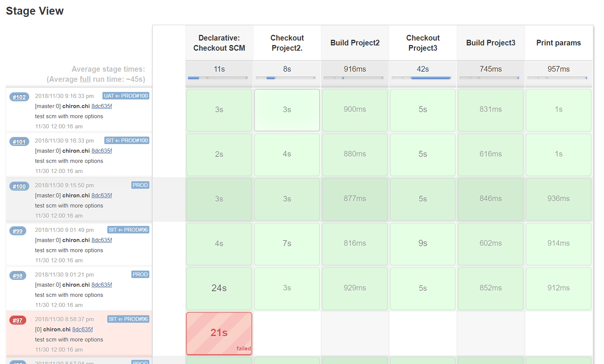

# Pipeline Stage View Plugin



This plugin is a fork of Jenkins Pipeline Stage View Plugin, a graphical swimlane view of pipeline stage execution (as well as a build history of the stages). 

See the [Plugin Wiki](https://wiki.jenkins-ci.org/display/JENKINS/Pipeline+Stage+View+Plugin) for release information and documentation. 

## Customization: 

- Display last commit branch name
- Display last commit author, description
- Display change set total commits
- Display change set commits history with popup
- Display ENVIRONMENT
- Pipeline promote build support


## pipeline-promote plugin

Pipeline-promote plugin is used to promote pipeline build. 

- It supports 3 preset environments: SIT/UAT/PROD. 
- It saves each build's Git commit hash as variables for each SCM. 
- For promote build, it sends PROMOTE_FROM_ENVIRONMENT and PROMOTE_FROM_VERSION variables to Jenkinsfile.
- The Jenkinsfile needs to checkout the specified commit and trigger build for target environment.

### How to install

The tutorial is for Ubuntu linux. 

1. Install Jenkins.
   
   ```
   wget -q -O - https://pkg.jenkins.io/debian/jenkins-ci.org.key | sudo apt-key add -
   sudo sh -c 'echo deb http://pkg.jenkins.io/debian-stable binary/ > /etc/apt/sources.list.d/jenkins.list'
   sudo apt-get update
   sudo apt-get install jenkins
   ```
   
   > Note: Make sure jenkins pipeline-stage-view plugin is installed.
   
2. Download Darumatic pipeline-stage-view plugin. 

   To download the latest release [2.11.102-SNAPSHOT](https://github.com/darumatic/pipeline-stage-view-plugin/releases/tag/2.11.102-SNAPSHOT)
   
3. Upload Darumatic pipeline-stage-view.jpi and pipeline-rest-api.jpi to Jenkins server.
   
4. Override pipeline-stage-view.jpi and pipeline-rest-api.jpi.

   ```
   mv pipeline-stage-view.jpi /var/lib/jenkins/plugins/pipeline-stage-view.jpi
   mv pipeline-rest-api.jpi /var/lib/jenkins/plugins/pipeline-rest-api.jpi
   mv pipeline-promote-api.jpi /var/lib/jenkins/plugins/pipeline-promote-api.jpi

   ```
5. Restart Jenkins. 
   ```
   sudo service restart jenkins
   ```  
6. Open Jenkins console, create an example pipeline job. 
   
   The test pipeline job contains 3 git repositories. The main repository contains Jenkinsfile. and Jenkinsfile build 2 other repositories.

7. Select "This project is parameterized", add String parameter ENVIRONMENT.
8. Config pipeline GIT SCM, create the job.
   ```
   https://github.com/Chi996/jenkins-test-project.git
   ```
   
   
   The example Jenkinsfile:
   
    ```
    pipeline {
        agent any
    
        stages {
            stage('Checkout Project2.') {
                steps {
                    script {
                        if (params.PROMOTE_FROM_ENVIRONMENT != null) {
                            checkout([$class: 'GitSCM',
                                    branches: [[name: params.PROJECT2_GIT_COMMIT]],
                                    userRemoteConfigs: [[url: 'https://github.com/Chi996/jenkins-test-project2.git', name:'project2']]])
                        }else{
                            checkout([$class: 'GitSCM',
                                     branches: [[name: params.ENVIRONMENT]],
                                     userRemoteConfigs: [[url: 'https://github.com/Chi996/jenkins-test-project2.git', name:'project2']]])
                        }
                    }
                }
            }
            stage('Build Project2') {
                 steps {
                     sh 'ls -al'
                 }
            }
            stage('Checkout Project3') {
                steps {
                    script {
                        if (params.PROMOTE_FROM_ENVIRONMENT != null) {
                            checkout([$class: 'GitSCM',
                                    branches: [[name: params.PROJECT3_GIT_COMMIT]],
                                    userRemoteConfigs: [[url: 'https://github.com/Chi996/jenkins-test-project3.git', name:'project3']]])
                        }else{
                            checkout([$class: 'GitSCM',
                                     branches: [[name: params.ENVIRONMENT]],
                                     userRemoteConfigs: [[url: 'https://github.com/Chi996/jenkins-test-project3.git', name:'project3']]])
                        }
                    }
                }
            }
            stage('Build Project3') {
                 steps {
                    sh 'ls -al'
                 }
            }
            stage('Print params'){
                steps {
                    echo "ENVIRONMENT: ${params.ENVIRONMENT}"
                    echo "PROMOTE_FROM_ENVIRONMENT: ${params.PROMOTE_FROM_ENVIRONMENT}"
                    echo "PROMOTE_FROM_VERSION: ${params.PROMOTE_FROM_VERSION}"
    
                    echo "ROOT_GIT_COMMIT: ${params.ROOT_GIT_COMMIT}"
                    echo "PROJECT2_GIT_COMMIT: ${params.PROJECT2_GIT_COMMIT}"
                    echo "PROJECT3_GIT_COMMIT: ${params.PROJECT3_GIT_COMMIT}"
                }
            }
        }
    }
    ```
   
   > NOTE: SCM checkout in Jenkinsfile must have a name. The git commit hash variable is $NAME_GIT_COMMIT. If there no name, the variable is skipped.

9. Go to jenkins job page, trigger a normal build.
10. After the build complete, mouse hover the build's stage view. Click the right bottom promote button, select promote target environment, trigger a promote build.
   
   Promote multi environments will trigger multi builds.

11. After the promote build completed. 
   
   The "PROD <= UAT#26" means current build is for PROD environment and it is promoted from UAT build#26.


